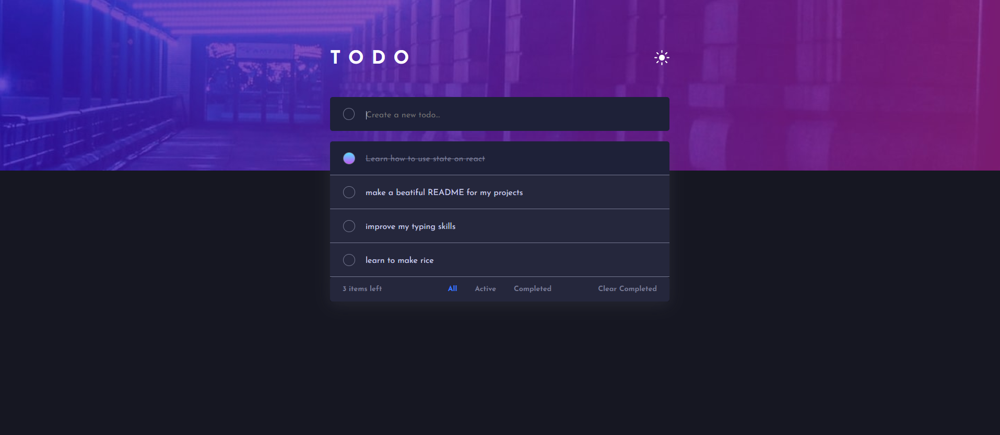
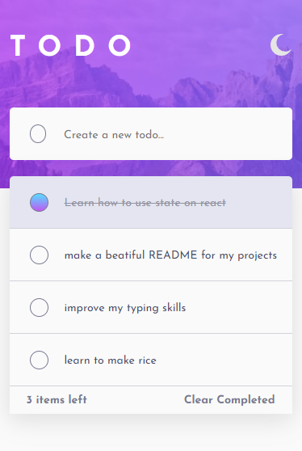

# ToDo APP

## Table of contents

- [Overview](#overview)
  - [Screenshot](#screenshot)
  - [Links](#links)
- [My process](#my-process)
  - [Built with](#built-with)  
  - [Continued development](#continued-development)
- [Author](#author)

## Overview

### Screenshot

### Desktop

### Mobile

### Links

- [Solution Live URL](https://inanbruneli.github.io/react-todo-app/)

## My process

### Built with

- ReactJS
 - Styled-Component
 - localStorage
 - Context
 - Typescript

### Continued development

My first ReactJS project, I'm still learning.
So, feel free to put your feedback 🚀🚀
Don't forget do use light/dark mode!!

## Next step

I really like this design, so I'm going to add pomodoro function to the project!

## Author

- Instagram - [@inanbrunelli](https://www.instagram.com/inanbrunelli)
- Github - [@inanbrunelli](https://github.com/inanbruneli)
- Website - [inanbrunell.com](https://inanbruneli.github.io/portifolio/)